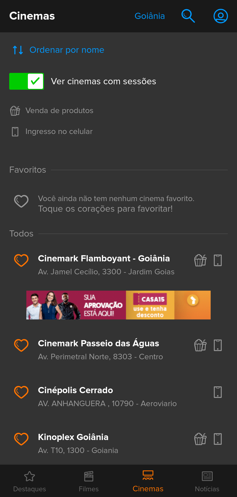
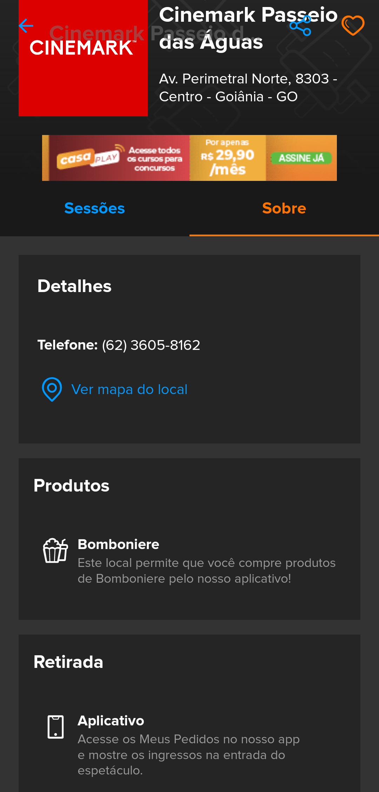
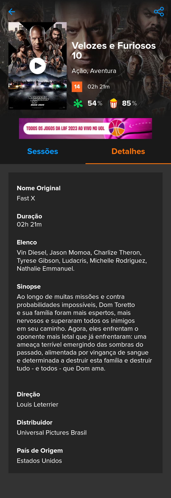
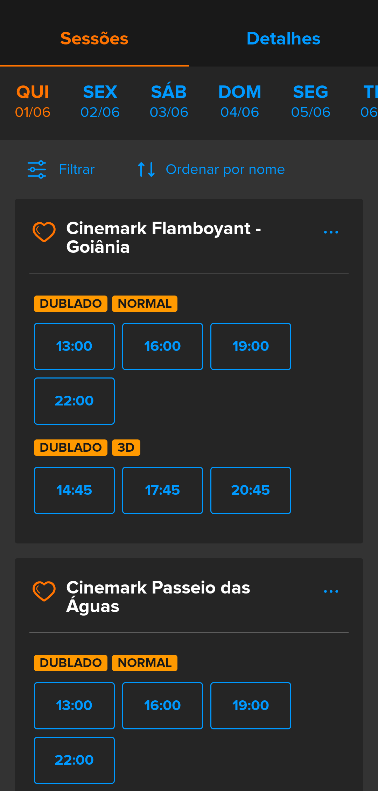
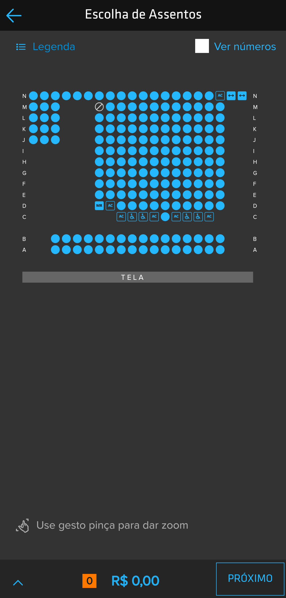
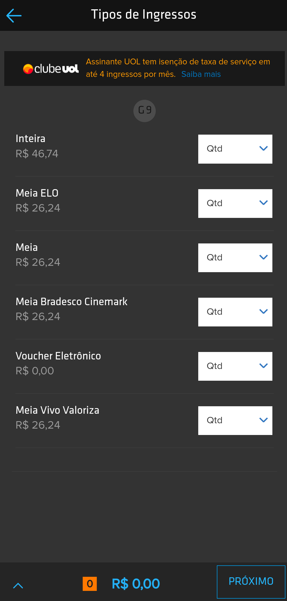
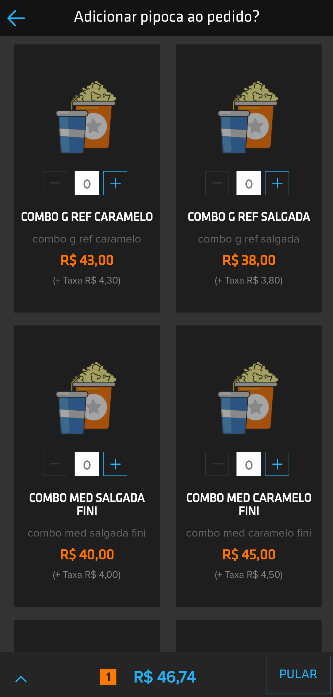
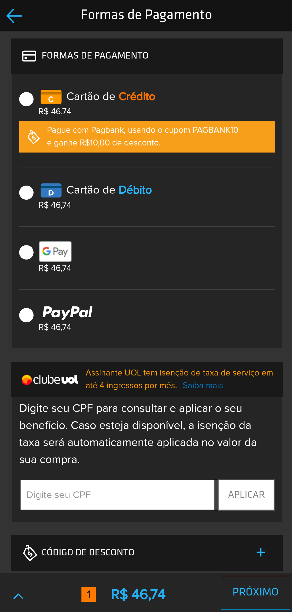
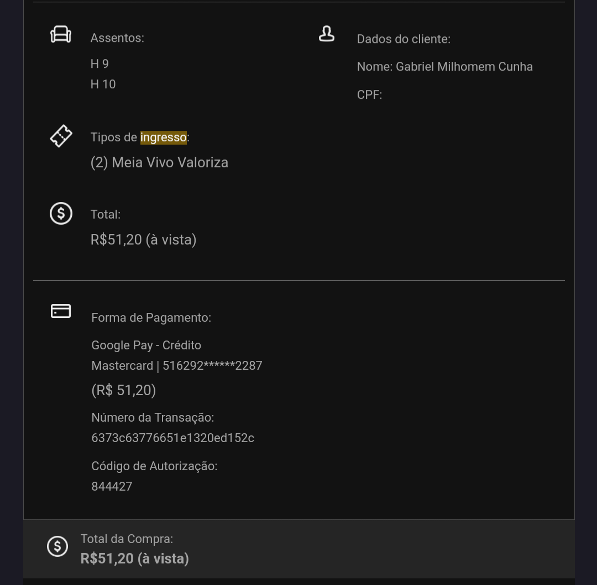

# BD - Ingresso.com (Ticketeria Online)
Projeto Final da disciplina de Banco de Dados UFG 2023/1

## Projeto Conceitual

### Definição do objetivo

O objetivo deste projeto é desenvolver um banco de dados para suportar uma plataforma de venda de ingressos online exclusivamente para cinema, inspirada no aplicativo já existente chamado [Ingresso.com](https://www.ingresso.com/). O banco de dados será responsável por armazenar e gerenciar todas as informações relevantes para a venda de ingressos, sessões de cinema, filmes em cartaz, assentos disponíveis, informações dos usuários e transações de pagamento. O banco de dados será projetado para garantir a integridade dos dados, oferecer consultas eficientes e proporcionar uma experiência de compra de ingressos fácil e segura para os usuários.
### Descrição do cenário e do escopo

A plataforma de ticketeria online para cinema será um ambiente virtual onde os usuários poderão buscar e adquirir ingressos para sessões de cinema disponíveis. O escopo do projeto abrange as seguintes funcionalidades:

1. **Busca de filmes:** Os usuários podem buscar filmes específicos e navegar por uma lista de filmes em cartaz ou filmes em breve. Os resultados exibem informações básicas como título, capa e classificação indicativa.

    

2. **Seleção de cinema:** Os usuários podem escolher o cinema desejado para ver os filmes em cartaz. A plataforma apresenta uma lista dos cinemas disponíveis, permitindo que os usuários selecionem o cinema mais conveniente com base na proximidade, horários de exibição e comodidades oferecidas.

    
    

3. **Detalhes do filme:** Ao selecionar um filme, os usuários têm acesso a informações detalhadas, como elenco, diretor, gênero, duração, sinopse, trailer, país de origem, avaliação entre outros.

    

4. **Seleção de sessão:** Os usuários podem escolher a sessão desejada para assistir ao filme, selecionando o dia e verificando os horários de exibição disponíveis. Também é possível escolher o tipo de exibição, como legendado, dublado, normal ou 3D.

    

5. **Seleção de assentos:** Após escolher a sessão, os usuários podem selecionar os assentos disponíveis no cinema. Um mapa da sala de cinema é exibido, mostrando a disposição dos assentos e indicando quais estão livres, ocupados ou reservados.

    

6. **Seleção tipo de ingresso + comida**: Os usuários podem escolher o tipo de ingresso desejado para cada assento selecionado, como ingresso inteiro, meia-entrada ou voucher. Além disso, é possível adicionar comidas e bebidas ao pedido, como pipoca, refrigerante e doces.

    
    

7. **Carrinho de compras:** Os usuários têm a opção de adicionar os ingressos desejados ao carrinho de compras, onde podem revisar e confirmar suas escolhas antes do pagamento. O carrinho de compras exibe um resumo da compra, incluindo o número de ingressos selecionados, o valor total a pagar e outras informações relevantes.

    

8. **Pagamento:** Os usuários podem selecionar a forma de pagamento desejada, como cartão de crédito, débito online ou pagamento digital, e fornecer as informações necessárias para efetuar o pagamento. A plataforma garante a segurança dos dados do usuário durante o processo de pagamento.

    

9. **Emissão de ingressos:** Após a confirmação bem-sucedida do pagamento, os ingressos são enviados para o e-mail cadastrado pelo usuário e também podem ser acessados através de um código QR na plataforma. Os usuários podem imprimir os ingressos ou apresentar o código QR na entrada do cinema para acessar a sessão.

    
    

10. **Minha Conta:** Os usuários podem acessar seu histórico de compras, visualizar detalhes de pedidos anteriores, atualizar informações pessoais como endereço e número de telefone, e gerenciar os cartões de pagamento associados à conta para uma experiência de compra mais rápida e conveniente.

    

### Definição dos requisitos
Com base na descrição do cenário e escopo do projeto, os seguintes requisitos podem ser identificados para o banco de dados da plataforma de venda de ingressos online para cinema:

1. **Armazenamento de Filmes:** O banco de dados deve armazenar informações completas sobre os filmes disponíveis, incluindo título, capa, classificação indicativa, sinopse, elenco, diretor, gênero, duração, país de origem, trailer e avaliação.

2. **Gerenciamento de Cinemas:** O banco de dados deve permitir o cadastro e gerenciamento dos cinemas parceiros, armazenando informações como nome, endereço, cidade e comodidades oferecidas por cada cinema.

3. **Registro de Sessões de Cinema:** O banco de dados deve registrar as sessões de cinema disponíveis, associando cada sessão a um filme específico, cinema, data, horário e tipo de exibição.

4. **Mapeamento de Assentos:** O banco de dados deve permitir o mapeamento dos assentos disponíveis em cada sessão de cinema, incluindo número do assento, fileira, status (livre, ocupado, reservado) e tipo de assento.

5. **Cadastro de Usuários:** O banco de dados deve permitir o cadastro e armazenamento das informações dos usuários, como nome, e-mail, endereço e número de telefone, para facilitar a compra de ingressos e acesso a recursos personalizados.

6. **Registro de Transações de Pagamento**: O banco de dados deve registrar as transações de pagamento realizadas pelos usuários, armazenando informações como valor da transação, forma de pagamento utilizada e data/hora da transação.

7. **Histórico de Compras**: O banco de dados deve manter um histórico de compras dos usuários, permitindo o acesso aos detalhes dos pedidos anteriores, incluindo informações sobre os filmes, sessões, assentos selecionados e dados de pagamento.

8. **Gerenciamento de Cartões de Pagamento:** O banco de dados deve permitir que os usuários cadastrem e gerenciem os cartões de pagamento associados às suas contas.

9. **Gerenciamento de Produtos de Comidas:** O banco de dados deve permitir o cadastro e gerenciamento dos produtos de comidas disponíveis para venda, como pipoca, doces. Ele deve armazenar informações como nome, descrição, preço e disponibilidade de cada produto.

10. **Gerenciamento de Tipos de Ingresso:** O banco de dados deve permitir o cadastro e gerenciamento dos tipos de ingresso disponíveis, como ingresso inteiro, meia-entrada ou voucher. Ele deve armazenar informações como nome, descrição e preço de cada tipo de ingresso. E deve permitir que os usuários selecionem o tipo de ingresso desejado para cada assento selecionado.
